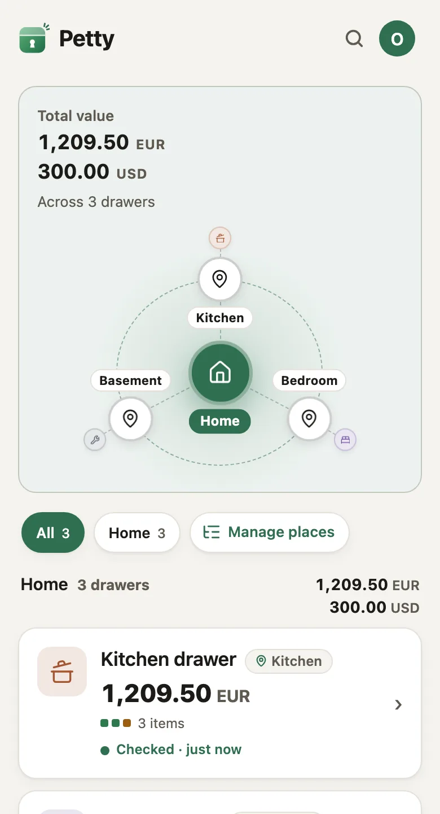
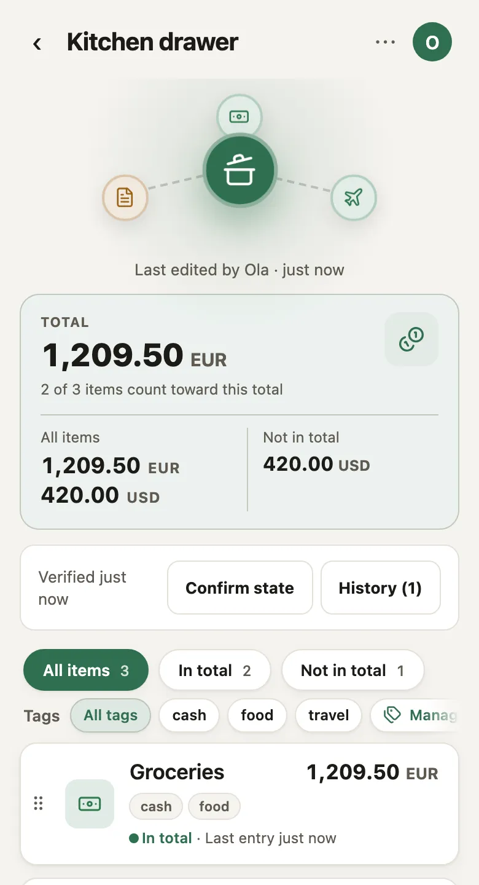
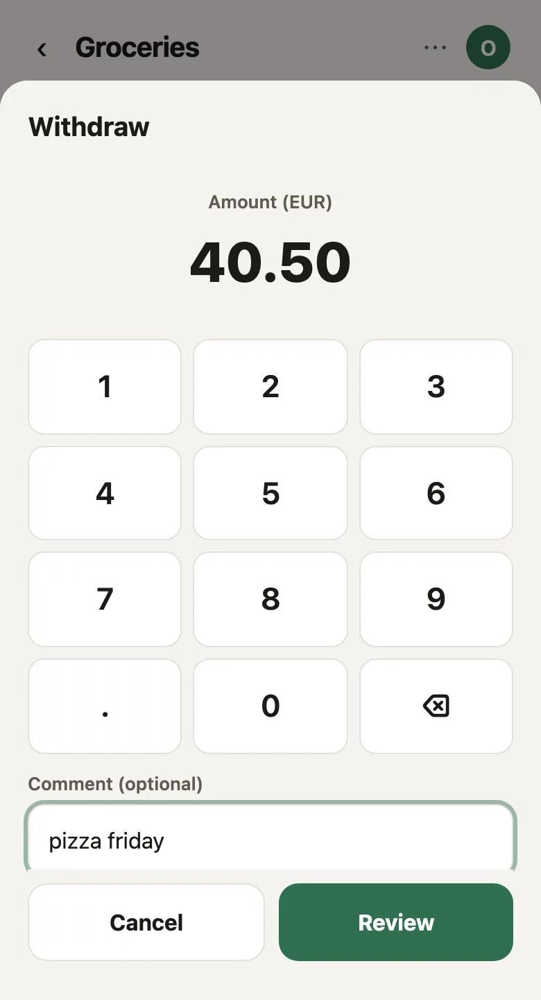

<picture>
  <source media="(prefers-color-scheme: dark)" srcset="docs/brand/petty-logo-dark.svg">
  
</picture>

# Petty

**A private ledger for the cash and valuables in your home.** Petty keeps track of what is in
each drawer, tin and envelope, in any currency, and shares a drawer only with the people you
choose. Everything is encrypted on your device before it is sent.

<p>
  
  
  
</p>

## What it does

- **Drawers in places.** A drawer lives in a place, for example Kitchen › shelf › tin. Moving a
  room moves its drawers.
- **Currencies and things.** Zloty, euro and dollars side by side, plus countable things like
  keys or documents. Tag items and filter by tag.
- **Shared, with roles.** Writers add entries; readers only look. The server enforces this.
- **Count, confirm, never erase.** Confirm a drawer after a real count. Mistakes are reversed,
  not deleted.
- **Passkey first, works offline.** Face ID, Touch ID or Windows Hello opens your vault. It
  installs like an app and keeps working without a network.
- **English and Polish.**

## Security in five lines

1. Drawer content is encrypted in the browser (AES-256-GCM). The server stores ciphertext only.
2. Each drawer has its own key, wrapped for each member with ECDH P-256. Your private keys never
   leave your device unencrypted.
3. Your keys sit in a vault opened by a passkey or a passphrase (Argon2id), with a recovery code.
4. Every ciphertext is bound to its row, drawer, line and author, and entries form a signed hash
   chain, so a server cannot move, re-attribute or silently drop them.
5. Permissions and append-only history are enforced by the server and the database, not by the UI.

The full design is in `petty-app-spec.md`. The latest security review is
`docs/security-review-2026-09.md`. Report problems privately as described in `SECURITY.md`.

## Run your own

```
cp deploy/compose/.env.example deploy/compose/.env    # fill in the values
docker compose -f deploy/compose/docker-compose.yml --env-file deploy/compose/.env up -d
```

Then put an HTTPS reverse proxy in front of `127.0.0.1:3000`. `docs/deploy.md` has the details,
and `docs/monitoring.md` covers metrics, logs and traces.

## License

Copyright (C) 2026 Petty contributors. Petty is free software under the GNU Affero General Public
License v3.0 (`LICENSE`, and `NOTICE`). If you run a changed version for other people, you must
offer them its source. Contributions are welcome; see `CONTRIBUTING.md` and `CODE_OF_CONDUCT.md`.

---

# Development setup

This part covers running Petty locally. Nothing here needs a cloud account or network access
after `pnpm install`.

## Try it with a seeded household (Docker only)

```
make demo          # pulls the published image (PETTY_TAG=<tag> for another), migrates, seeds two people and six drawers
make demo-local    # same, but builds the image from your working tree (no CI, no registry)
make demo-down     # stop it
make demo-reset    # stop it and drop the data (shares the local dev database volume)
```

Open http://localhost:3300 (mail at http://localhost:8025). Logins are printed by the
seed: `ania@petty.local` / `password-ania` / vault passphrase `vault ania 2026 drawer`;
`bartek@petty.local` / `password-bartek` / `vault bartek 2026 drawer`.

## Settings: one `.env` at the root

Copy `.env.example` to `.env` (gitignored). The API dev server, the tests, Playwright and
`docker compose` all read that one file; the web app needs none (it asks the API). Anything
already in the environment wins over the file. The production image carries no file: a
deployment passes the same names as environment variables or secrets.

## Requirements (clean machine)

- Docker Desktop (or any Docker with Compose v2)
- Node 22 or newer (`.node-version` says 22; Node 24 works)
- pnpm 11: `corepack enable && corepack prepare pnpm@11.2.2 --activate`
- GNU make (preinstalled on macOS; `apt install make` on Debian/Ubuntu)

## First run

```
pnpm install
make dev
```

`make dev` starts Postgres 16 and Mailpit in Docker, waits for the database, runs the
migrations, then starts the API on http://127.0.0.1:3000 and the web app on
http://localhost:5173. Stop everything with Ctrl-C and `make stop`.

Then, in a second terminal:

```
make seed        # three test users
curl localhost:3000/health   # {"ok":true,"db":"up"}
```

## Test users

| Email | Login password | Vault passphrase (from Phase 2 on) |
|---|---|---|
| alice@petty.local | password-alice | vault alice 2026 drawer |
| bob@petty.local   | password-bob   | vault bob 2026 drawer |
| carol@petty.local | password-carol | vault carol 2026 drawer |

Mailpit catches every email the app sends (join links, invitations, removals, ownership
offers): http://localhost:8025. Set `SMTP_HOST`/`SMTP_PORT`/`MAIL_FROM`/`APP_URL` for a real provider.

## Commands

| Command | Does |
|---|---|
| `make dev` | db + mailpit + migrate + api + web |
| `make seed` | three users + a shared "Kitchen" drawer with real ciphertext (skips if alice exists; `make reset` first to reseed) |
| `make test` | every vitest suite (API tests need the db) |
| `make lint` | typecheck + eslint |
| `make reset` | drop the database volume, migrate again |
| `pnpm --filter @petty/api migrate:create <name>` | new empty SQL migration |

## Offline

The web app is an installable PWA. The service worker caches the app shell only;
API responses are never HTTP-cached. Ciphertext (vault blob, bootstrap) and
non-extractable key handles live in IndexedDB, so unlock and reading work offline.
Entries and document edits made offline wait in an encrypted outbox and are sent
on reconnect (idempotent by client id); the home screen then reports what changed
while you were away and which queued changes were refused.

`pnpm e2e` runs two Playwright projects: `dev` (Vite dev server) and `prod`
(the API serving the production build on :3100 under the strict security headers;
fails on any CSP violation; service worker active).

## Layout

```
apps/api        Fastify API. All writes go through here. Connects as petty_api;
                petty_maint only inside rotation and deletion.
apps/web        Vite + React SPA. Holds keys in memory; never writes plaintext to disk.
packages/crypto Envelope encryption, AAD binding, signatures, compatibility corpus.
packages/ledger Pure domain: balance fold, chain verification, money formatting,
                line extras (icon, tags, counted) and place paths.
packages/protocol zod schemas shared by api and web.
apps/api/migrations  Version-controlled SQL migrations (node-pg-migrate).
docker/postgres/init.sql  Dev-only: creates petty_api / petty_maint with LOGIN.
```

## Places, icons and tags

A drawer sits in one **place** of a tree (`Home › Kitchen › shelf`): the path of
names is stored in the drawer's encrypted document, the tree itself in the
person's encrypted user document (`apps/web/src/lib/places.ts`, edited on
`/places`). Renaming or moving a place rewrites the path on the drawers you can
write. Drawers and lines carry an optional Lucide icon slug; lines carry tags
and a "part of the total" flag, all inside the document. Details and the
reasoning: `petty-app-spec.md`, section "Places, icons and line tags".

## API (apps/api)

All bodies are JSON; bytes travel as base64; the server never opens ciphertext.
Session = httpOnly cookie `petty_session`. Non-members get 404, never 403.

| Route | Who | Does |
|---|---|---|
| `POST /auth/signup` `POST /auth/login` `POST /auth/logout` | – | invite-only signup with vault blobs and public keys; login; logout |
| `POST /join-links` `GET /join-links/:token` | user | create / inspect a join link (7 days) |
| `GET /me` `PATCH /me` `GET /users/lookup?email=` `GET /users/:id/keys` | user | profile, locale, exact-email lookup for inviting, key history |
| `GET /me/doc` `PUT /me/doc` | user | the user's own encrypted document (key pins), version-checked |
| `GET /bootstrap` | user | all drawers, documents, my wraps, members, entries since each line's last Adjust, invitations, transfers |
| `POST /drawers` `GET /drawers/:id` `DELETE /drawers/:id` | user / read / owner | create; read; permanent delete via `delete_drawer()` |
| `PUT /drawers/:id/document` | write | optimistic lock on `base_version` → 409 `VersionConflict`; `verification: true` stamps `last_verified_at` |
| `GET/PUT/DELETE /drawers/:id/photo` | read / write | own encrypted row |
| `POST /drawers/:id/lines/:lineId/delete` | write | new document + entries removed via `delete_line()` |
| `POST /drawers/:id/entries` | write | append; idempotent on client id; Adjust needs `expected_head_seq` → 409 `RecountRequired`; Reverse rules → 409 `ReverseRefused` |
| `GET /drawers/:id/lines/:lineId/entries?before=&limit=` | read | older pages |
| `GET /drawers/:id/members` `POST /drawers/:id/invitations` `GET /invitations` `POST /invitations/:id/accept|decline` `DELETE /invitations/:id` | read / owner / invitee | wrap at invite time; accept = membership + wrap |
| `DELETE /drawers/:id/members/:userId` `POST /drawers/:id/leave` | owner / member | removes wraps, sets `rotation_needed` |
| `POST /drawers/:id/transfer` `POST /drawers/:id/transfer/accept` `DELETE /drawers/:id/transfer` | owner / target | ownership moves only on acceptance |
| `POST /drawers/:id/rotation` `PUT /drawers/:id/rotation/batch` `GET /drawers/:id/rotation` | write | publish new key + wraps first; re-seal in batches (petty_maint); status |
| `GET /drawers/:id/export` | owner, write | everything for the drawer; read members get 403 |
| `GET /me/delete` `POST /me/delete` | user | preview; delete with per-drawer decisions (hand over / delete), password re-entered |
| `GET /me/recovery-vault` `PUT /me/vault` | user | recovery-code copy; replace the passphrase wrap of the same keys |

## Database roles

| Role | Used by | May |
|---|---|---|
| `petty` | migrations, seed | everything (owner) |
| `petty_api` | every API request | SELECT/INSERT on entries; no UPDATE/DELETE there |
| `petty_maint` | rotation, line/drawer/account deletion | column-restricted UPDATE, DELETE via functions |

Connection strings live in `.env.example`; copy to `.env` to override.

## Troubleshooting

- `pnpm install` says "Ignored build scripts: esbuild" → `pnpm-workspace.yaml` already
  allows it; run `pnpm install` again.
- Port 5432 busy → stop the local Postgres (`brew services stop postgresql`) or change the
  port in `docker-compose.yml` and `.env`.
